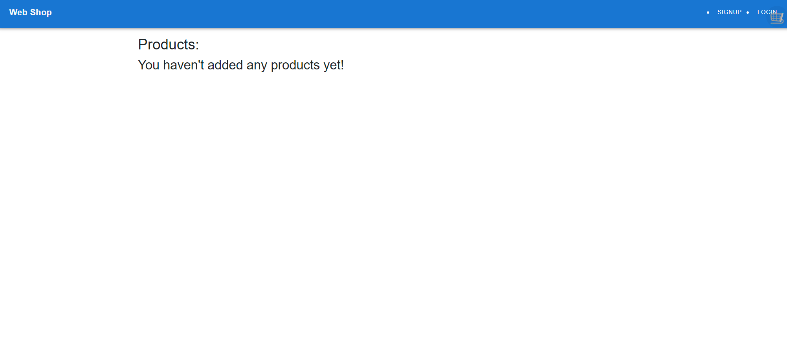

# Web Shop

## Description
WebShop - the place for Webs
 
## Table of Contents

- [Installation](#installation)
- [Technologies](#technologies)
- [Usage](#usage)
- [Contributing](#contributing)
- [License](#license)
- [Deployed Application](#deployed-application)
- [Screenshots](#screenshots)

## Installation

`npm install`, `npm run seed`, `npm run build`, `npm run develop`

## Technologies

  - Node.js and Express.js
  - GraphQL
  - MongoDB
  - Mongoose ODM
  - Queries
  - Mutations
  

## Usage
n/a

## Contributing

n/a

## License

## Deployed Application

[WebShop]( )

## Screenshots

*** Received Help from tutors and classmates